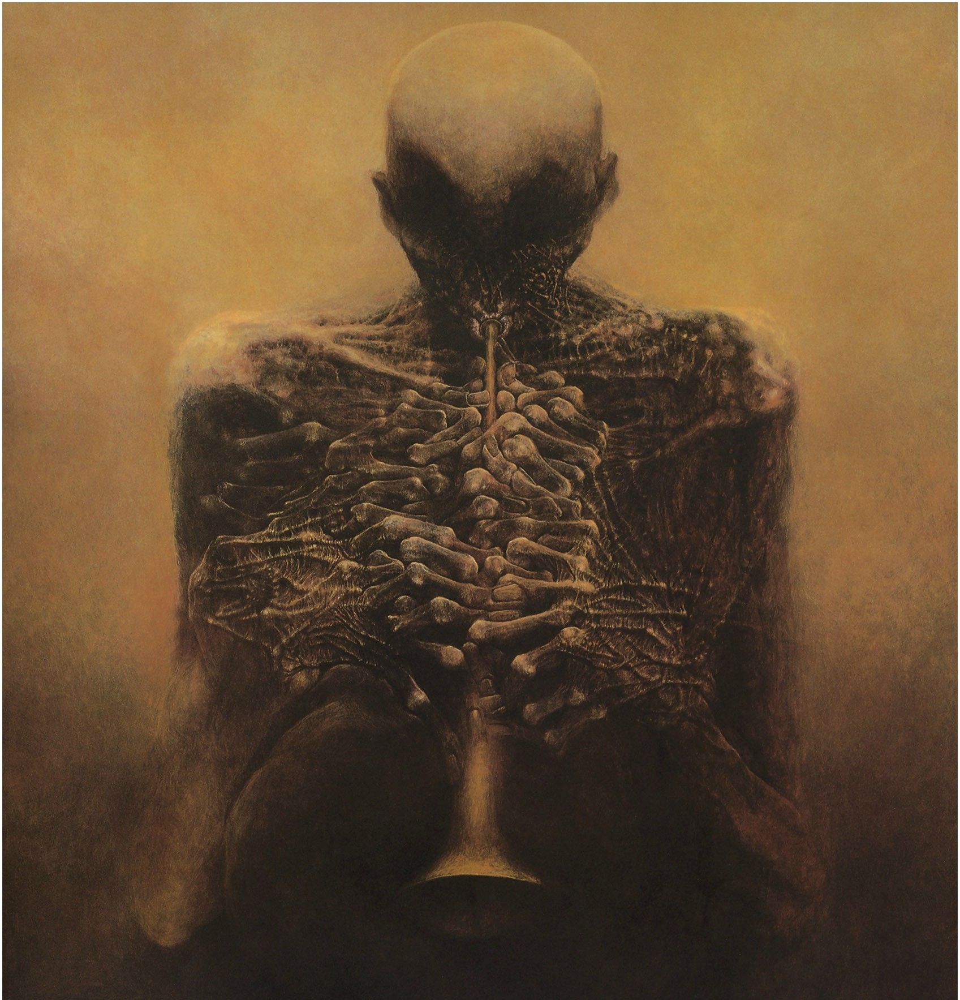
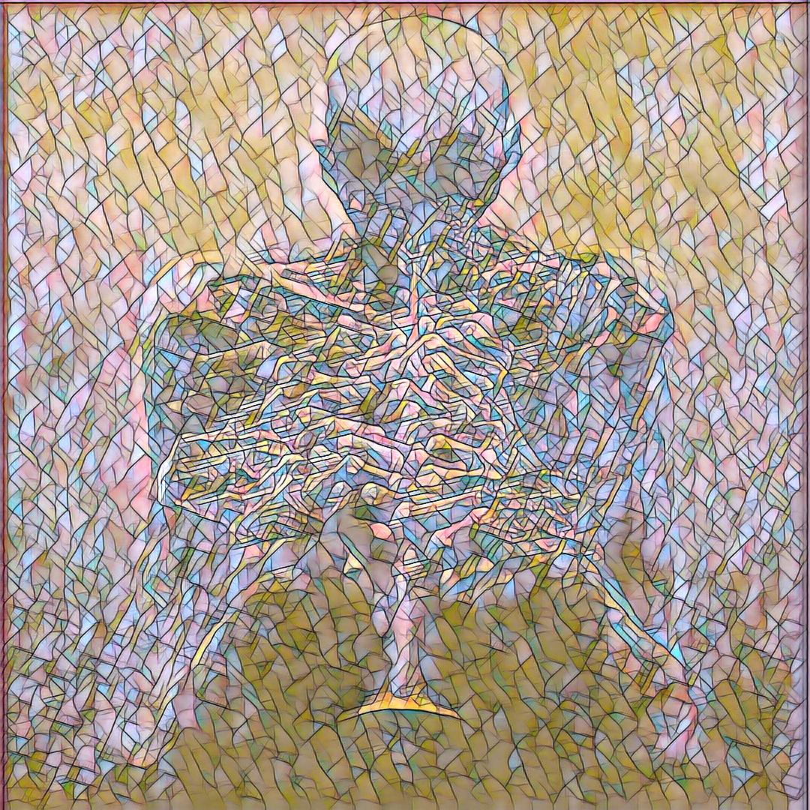
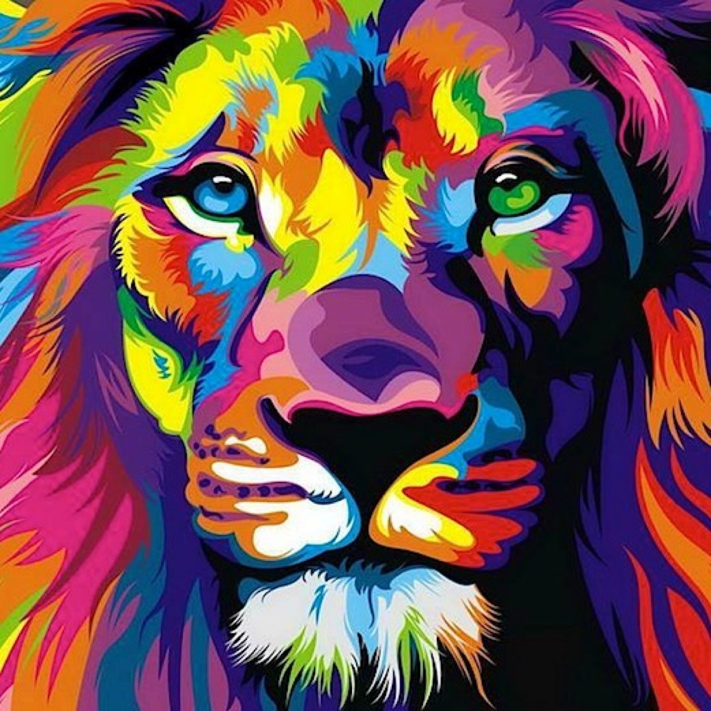
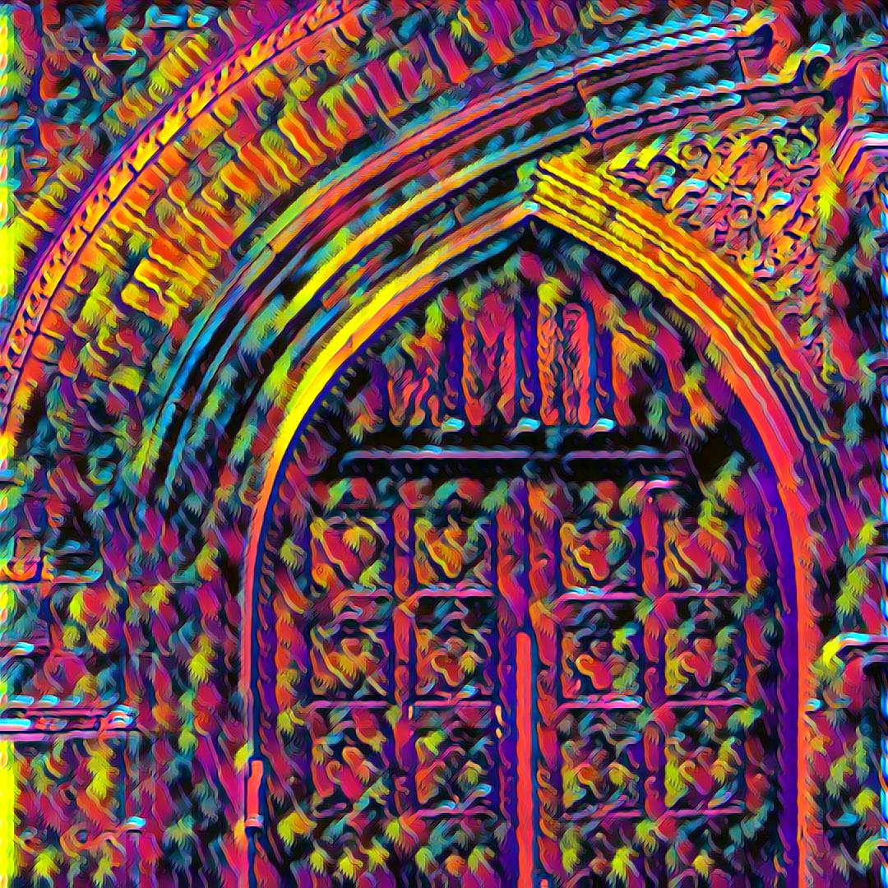

# Project Description
This is an implementation of fast neural style transfer using autoencoders. I used the VGG architecture to measure the style loss of the generated image against that of the original style image. Results can be seen below

## File Descriptions
- ```model.py``` - Autoencoder model definition
- ```vgg.py``` - VGG custom architecture to extract features
- ```loss.py``` - Function definitions of Content Loss and Style Loss
- ```utils.py``` - Helper functions
- ```dataset.py``` - Custom Dataset to provide images during training
- ```main.ipynb``` - Main training script

## Results
<div align = "center">



<br>
<br>



</div>

## Pre-trained Models
Pre-trained autoencoder models can be found [here](https://drive.google.com/drive/folders/1dqkjCWfv9-Go4WAaXoLxsARdb4XqTnhU?usp=sharing)

## Dependencies
- PyTorch 1.4.0
- Python 3.7.6
